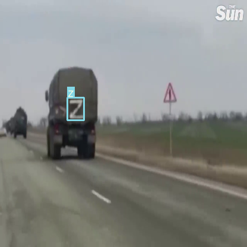
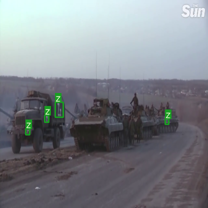

## Z-detector

 Це комп"ютер віжин детектор який розпізнає знаки Z,V,O на відео чи зображеннях

<p align="center"> 
   
</p>


### 1. Як використовувати 
 * На операційній системі з ядром лінукс (Ubuntu, Debian, інші..) виконуємо в терміналі:
 ```
 pip install -r requirements.txt
 ```
   Щоб встановити необхідні пакети
 
 
 
 * далі в терміналі виконуємо:

```
python3 detect.py --cfg /home/user/yolov3.cfg --weights /home/user/yolov3_last.weights
```
   де файл навченої нейронної мережі yolov3_last.weights скачуємо звідси - https://easyupload.io/1vngmj
   (лінки через якийсь час стають не активні, запитуємо на пошту)
   
   /home/user/ - заміняємо на свою директорію


### 2. Як підключити камеру
 В строку наведену нижче - пишем

```
cap1 = cv2.VideoCapture("rtsp://192.168.1.2:8080/out.h264")
```
де rtsp://192.168.1.2:8080/out.h264 адреса вашої камери

### 3. Як тренувати

 https://github.com/AlexeyAB/darknet

### 4. Датасет
 
 Датасет взятий з відкритих джерел, а саме з ютубу. 
 
 Список знаходиться в файлі list.txt
 
 Лінк на датасет:

 [https://easyupload.io/hihog3](https://www.dropbox.com/s/3aaa1lllaagzxmb/s3s4s5s8.zip?dl=0)  part 3,4,5,8 (1.2Gb 3.4k images)
 (лінки через якийсь час стають не активні, запитуємо на пошту)

 
### 5. Хибні спрацювання

Строка 

```
im0 = cv2.resize(img, (416,  416), interpolation=cv2.INTER_LINEAR)

```
стискає вхідне зображення до  416х416 - чим більша роздільна здатність - тим краще розпізнавання, але тим повільніше працює.
Необхідним є наявність відеокарти Nvidia на сервері чи комп"ютері на якому запускається алгоритм для його швидкої роботи. Це прискорює роботу приблизно сотню разів, залежить від моделі відеокарти. Бажано мати GTX1050, RTX2050, RTX3050 чи кращі. На таких картах можна запускати декілька камер одночасно 

Також чим більший поріг, тим менше хибних спрацюваннь.
parser.add_argument('--conf-thres', type=float, default=0.1, help='object confidence threshold')

 
### 6. Найближчі апдейти
 * Обновлення датасету
 * Обновлення моделі
 * Буде додана можливість запускати по списку камер
 * Інтерфейс збереження спрацюваннь
 
### 7. Питання чи побажання
Пишем сюди z_detector@yahoo.com
