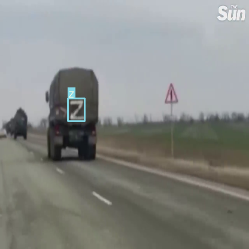
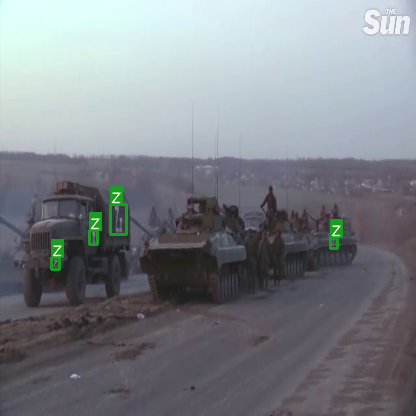

## Z-detector

 Це комп"ютер віжин детектор який розпізнає знаки Z,V,O на відео чи зображеннях

<p align="center"> 
   
</p>


### 1. Як використовувати 
 В терміналі виконуємо:

```
python3 detect.py --cfg /home/user/yolov3.cfg --weights /home/user/yolov3_last.weights
```


### 2. Як підключити камеру

### 3. Як тренувати

 https://github.com/AlexeyAB/darknet

### 4. Датасет
 
 Датасет взятий з відкритих джерел, а саме з ютубу.  Список буде наведений пізніше.  Лінк на датасет:

 https://easyupload.io/hihog3
